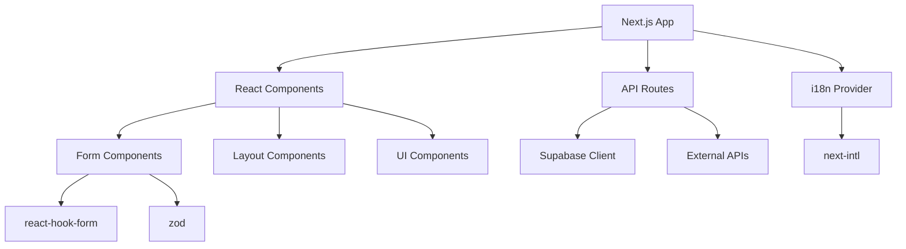

# Mimari Genel Bakış

**Kaynak:** diskhastanesi.com projesi - Microsoft Stack'e taşıma için hazırlanmıştır

Bu dosya, sistemin mimari yapısını, bileşenler arası ilişkileri ve veri akışlarını açıklar.

---

## 1. Sistem Mimarisi

### 1.1 High-Level Architecture

```
┌─────────────────────────────────────────────────────────────┐
│                      Kullanıcı (Browser)                     │
└────────────────────────┬────────────────────────────────────┘
                         │
                         │ HTTPS
                         │
┌────────────────────────▼────────────────────────────────────┐
│                   CDN / Edge Network                         │
│              (Vercel Edge / Azure Front Door)                │
└────────────────────────┬────────────────────────────────────┘
                         │
                         │
┌────────────────────────▼────────────────────────────────────┐
│                  Frontend Application                        │
│             (Next.js / ASP.NET Core)                        │
│  ┌──────────────┐  ┌──────────────┐  ┌──────────────┐     │
│  │  Pages/Views │  │  Components  │  │  API Routes  │     │
│  └──────────────┘  └──────────────┘  └──────┬───────┘     │
└───────────────────────────────────────────────┼─────────────┘
                                                │
                    ┌───────────────────────────┼───────────────────────────┐
                    │                           │                           │
┌───────────────────▼────────┐  ┌──────────────▼─────────┐  ┌─────────────▼────────┐
│   Edge Functions           │  │  Backend Services      │  │  External APIs       │
│   (Serverless)             │  │  (Application Logic)   │  │                      │
│                            │  │                        │  │  - Email Provider    │
│  - notify-lead             │  │  - Lead Service        │  │  - SMS Provider      │
│  - create-draft-link       │  │  - CMS Service         │  │  - hCaptcha          │
│  - retry-notifications     │  │  - Auth Service        │  │  - Analytics         │
└───────────────┬────────────┘  └──────────┬─────────────┘  └──────────────────────┘
                │                           │
                │                           │
┌───────────────▼───────────────────────────▼─────────────────┐
│                    Database Layer                            │
│                                                              │
│  ┌──────────────┐  ┌──────────────┐  ┌──────────────┐     │
│  │   Leads      │  │   Content    │  │   Sessions   │     │
│  │   Table      │  │   Tables     │  │   Table      │     │
│  └──────────────┘  └──────────────┘  └──────────────┘     │
│                                                              │
│         (Supabase PostgreSQL / Azure SQL)                   │
└──────────────────────────────────────────────────────────────┘
                                │
                                │
┌───────────────────────────────▼──────────────────────────────┐
│                   Monitoring & Observability                 │
│                                                              │
│  ┌──────────────┐  ┌──────────────┐  ┌──────────────┐     │
│  │   Sentry     │  │  App Insights│  │  Log Storage │     │
│  │ (Errors)     │  │ (Metrics)    │  │              │     │
│  └──────────────┘  └──────────────┘  └──────────────┘     │
└──────────────────────────────────────────────────────────────┘
```

### 1.2 Mevcut Stack (Next.js + Supabase)

**Frontend Tier**
- Framework: Next.js 15.5.4 (App Router)
- UI: React 19.1.1
- Styling: Tailwind CSS 4.1.13
- i18n: next-intl 4.3.9
- Forms: react-hook-form + zod

**Backend Tier**
- Edge Functions: Supabase Edge Functions (Deno)
- API Routes: Next.js API routes
- Authentication: Supabase Auth (planlanmış)

**Data Tier**
- Database: Supabase PostgreSQL
- Storage: Supabase Storage (planlanmış)
- Realtime: Supabase Realtime (planlanmış)

**Deployment**
- Hosting: Vercel
- CDN: Vercel Edge Network
- Edge: Supabase Edge Functions

**Observability**
- Error Tracking: Sentry
- Analytics: Custom + Supabase metrics
- Logging: Pino

### 1.3 Hedef Stack (Microsoft Azure)

**Frontend Tier**
- Framework: ASP.NET Core 8.0 (Razor Pages / Blazor)
- UI: Blazor WebAssembly / MVC
- Styling: Bootstrap / Tailwind
- i18n: Resource files (.resx)

**Backend Tier**
- API: ASP.NET Core Web API / Minimal API
- Functions: Azure Functions
- Authentication: Azure AD B2C / Entra ID

**Data Tier**
- Database: Azure SQL Database
- Storage: Azure Blob Storage
- Cache: Azure Redis Cache
- Queue: Azure Service Bus

**Deployment**
- Hosting: Azure App Service
- CDN: Azure Front Door + CDN
- Functions: Azure Functions (Consumption / Premium)

**Observability**
- Monitoring: Application Insights
- Logging: Azure Monitor + Log Analytics
- Analytics: Azure Monitor Workbooks

---

## 2. Component Bağımlılıkları

### 2.1 Frontend Dependencies



**Core Dependencies**
- `next`: Framework
- `react`, `react-dom`: UI library
- `@supabase/supabase-js`: Database client
- `next-intl`: Internationalization
- `react-hook-form`: Form management
- `zod`: Schema validation
- `@sentry/nextjs`: Error tracking

**Dev Dependencies**
- `typescript`: Type safety
- `eslint`, `prettier`: Code quality
- `vitest`: Unit testing
- `@playwright/test`: E2E testing

### 2.2 Backend Dependencies

**Supabase Edge Functions (Deno)**
- Deno runtime
- Supabase client library
- Email/SMS providers

**Azure Functions (Microsoft)**
- .NET 8.0 runtime
- Azure SDK
- Entity Framework Core
- Dapper (optional)

### 2.3 Database Dependencies

**Current (PostgreSQL)**
- Supabase managed PostgreSQL
- Row Level Security (RLS)
- Realtime subscriptions

**Target (Azure SQL)**
- SQL Server 2022
- Entity Framework Core migrations
- Azure SQL managed instance

---

## 3. Data Flow (Veri Akışı)

### 3.1 Lead Submission Flow

```
User fills form
      │
      ▼
Client-side validation (Zod)
      │
      ▼
API POST /api/edge/notify-lead
      │
      ▼
Server-side validation
      │
      ├─────────────────────────────┐
      ▼                             ▼
Insert to Database        Trigger Edge Function
(leads table)             (notification)
      │                             │
      │                             ├──────────┐
      │                             ▼          ▼
      │                        Send Email  Send Slack
      │                             │          │
      ▼                             ▼          ▼
Return success                Success    Success
      │
      ▼
Show success message to user
```

### 3.2 Content Delivery Flow

```
User requests page (/tr/veri-kurtarma)
      │
      ▼
CDN Cache check
      │
      ├─── Cache HIT ────┐
      │                  ▼
      │            Return cached page
      │
      └─── Cache MISS
            │
            ▼
      Next.js Server
            │
            ▼
      Fetch from CMS (if dynamic)
            │
            ▼
      Render page (RSC)
            │
            ▼
      Cache in CDN
            │
            ▼
      Return to user
```

### 3.3 Authentication Flow (Planned)

```
User login attempt
      │
      ▼
POST /api/auth/login
      │
      ▼
Azure AD B2C / Supabase Auth
      │
      ├─── Valid ────────┐
      │                  ▼
      │            Create session
      │                  │
      │                  ▼
      │            Return JWT token
      │                  │
      │                  ▼
      │            Store in httpOnly cookie
      │                  │
      │                  ▼
      │            Redirect to dashboard
      │
      └─── Invalid
            │
            ▼
      Return error
```

### 3.4 Real-time Notification Flow

```
Event occurs (new lead)
      │
      ▼
Database trigger / Change Data Capture
      │
      ▼
Message queue (Service Bus / Supabase Realtime)
      │
      ▼
Notification worker / Edge Function
      │
      ├──────────────┬──────────────┬──────────────┐
      ▼              ▼              ▼              ▼
  Email Queue   Slack Webhook  SMS Queue   Dashboard Update
      │              │              │              │
      ▼              ▼              ▼              ▼
  SendGrid       Slack API      Twilio     WebSocket push
```

---

## 4. Integration Points

### 4.1 External Services

**Email Provider**
- Current: Supabase SMTP relay (planned)
- Target: Azure Communication Services / SendGrid
- Purpose: Transactional emails, notifications
- Protocol: SMTP / REST API

**SMS Provider**
- Current: Not implemented
- Target: Twilio / Azure Communication Services
- Purpose: Critical lead notifications
- Protocol: REST API

**hCaptcha**
- Purpose: Bot protection on forms
- Integration: Client-side widget + server-side verification
- Endpoint: `https://hcaptcha.com/siteverify`

**Analytics**
- Current: Custom implementation
- Target: Azure Monitor + Google Analytics 4
- Purpose: User behavior tracking, conversion tracking

**CMS**
- Current: Planned (Sanity)
- Target: Azure Contentful / Headless CMS
- Purpose: Content management, localization
- Protocol: REST API / GraphQL

### 4.2 Internal Services

**Lead Service**
- Responsibility: Lead CRUD operations
- Database: leads table
- API: `/api/leads/*`

**Notification Service**
- Responsibility: Multi-channel notifications
- Queue: Service Bus / Edge Functions
- Channels: Email, Slack, SMS

**Auth Service**
- Responsibility: User authentication & authorization
- Provider: Azure AD B2C / Supabase Auth
- Session: JWT tokens, httpOnly cookies

**CMS Service**
- Responsibility: Content fetching & caching
- Source: Headless CMS
- Cache: CDN + Redis

---

## 5. Deployment Architecture

### 5.1 Current (Vercel + Supabase)

```
GitHub Repository (main branch)
      │
      ▼
Vercel CI/CD Pipeline
      │
      ├──── Build ────────┐
      │                   ▼
      │             Next.js build
      │                   │
      │                   ▼
      │             Optimize assets
      │                   │
      ▼                   ▼
Preview Deploy    Production Deploy
(PR branches)     (main branch)
      │                   │
      ▼                   ▼
Vercel Edge         Vercel Edge
Network             Network (Global)
```

**Supabase Deployment**
```
Supabase Project (Cloud)
      │
      ├──── PostgreSQL (managed)
      │
      ├──── Edge Functions (Deno Deploy)
      │
      ├──── Storage (S3-compatible)
      │
      └──── Realtime (WebSocket)
```

### 5.2 Target (Azure)

```
GitHub Repository (main branch)
      │
      ▼
Azure DevOps Pipeline
      │
      ├──── Build ────────────┬──── Test ─────┐
      │                       │               │
      ▼                       ▼               ▼
.NET Publish            Unit Tests      Integration Tests
      │                       │               │
      │                       └───────┬───────┘
      │                               │
      │                          Tests PASS
      │                               │
      ▼                               ▼
Staging Slot Deploy          Smoke Tests
(App Service)                       │
      │                             │
      │                        Tests PASS
      │                             │
      ▼                             ▼
Manual Approval           Swap Slots
      │                             │
      │                             ▼
      └────────────────────> Production Slot
                                    │
                                    ▼
                            Azure Front Door
                            (Global CDN)
```

**Azure Resource Topology**
```
Resource Group: diskhastanesi-rg
      │
      ├──── App Service Plan (B1/S1)
      │     └── Web App (diskhastanesi)
      │
      ├──── Azure SQL Server
      │     └── Database (diskhastanesi-db)
      │
      ├──── Azure Functions (Consumption)
      │     ├── NotifyLeadFunction
      │     └── CreateDraftLinkFunction
      │
      ├──── Application Insights
      │
      ├──── Key Vault (secrets)
      │
      ├──── Blob Storage (media)
      │
      ├──── Front Door + CDN
      │
      └──── Service Bus Namespace
            ├── lead-notifications queue
            └── email-queue
```

### 5.3 High Availability & Disaster Recovery

**Current Setup**
- Vercel: Multi-region automatic
- Supabase: Single region (EU West)
- Backup: Supabase automatic daily backups

**Target Setup**
- Azure App Service: Zone redundancy (optional)
- Azure SQL: Geo-replication (West Europe + North Europe)
- Backup: Point-in-time restore (35 days)
- DR Plan: RTO < 1 hour, RPO < 5 minutes

---

## 6. Security Architecture

### 6.1 Network Security

**Current**
- HTTPS only (TLS 1.3)
- Vercel DDoS protection
- Supabase Row Level Security (RLS)

**Target**
- HTTPS only (TLS 1.3)
- Azure Front Door WAF (Web Application Firewall)
- Azure DDoS Protection
- VNet integration for backend services
- Private endpoints for SQL Database

### 6.2 Application Security

**Authentication**
- Azure AD B2C (OAuth 2.0 / OpenID Connect)
- Multi-factor authentication (MFA)
- JWT token with short expiry (15 min)
- Refresh token rotation

**Authorization**
- Role-based access control (RBAC)
- Claims-based authorization
- API key for external integrations

**Data Protection**
- Encryption at rest (AES-256)
- Encryption in transit (TLS 1.3)
- Secrets in Azure Key Vault
- PII data masking in logs

### 6.3 API Security

**Rate Limiting**
- Global: 100 req/min per IP
- Lead submission: 5 req/hour per IP
- API endpoints: 1000 req/min per API key

**Input Validation**
- Client-side: Zod schemas
- Server-side: FluentValidation / Data Annotations
- SQL injection: Parameterized queries
- XSS: HTML encoding, CSP headers
- CSRF: Anti-forgery tokens

---

## 7. Performance Architecture

### 7.1 Caching Strategy

**Levels**
1. **Browser Cache**: Static assets (images, CSS, JS)
   - Cache-Control: max-age=31536000 (1 year)
   
2. **CDN Cache**: HTML pages, API responses
   - Cache-Control: max-age=3600 (1 hour)
   - Stale-while-revalidate
   
3. **Server Cache**: Database queries, CMS content
   - Redis: Hot data (1-24 hours)
   - Memory: Frequently accessed data
   
4. **Database Cache**: Query result cache
   - SQL Server query plan cache
   - Materialized views for complex queries

### 7.2 Performance Targets

**Core Web Vitals**
- LCP (Largest Contentful Paint): < 2.5s
- FID (First Input Delay): < 100ms
- CLS (Cumulative Layout Shift): < 0.1
- TTFB (Time to First Byte): < 600ms

**API Response Times**
- p50: < 200ms
- p95: < 500ms
- p99: < 800ms

**Database Query Times**
- Simple queries: < 10ms
- Complex queries: < 100ms
- N+1 queries: Zero tolerance

### 7.3 Scalability

**Horizontal Scaling**
- App Service: Auto-scale (2-10 instances)
- Azure Functions: Consumption plan (auto-scale)
- Database: Read replicas for read-heavy workloads

**Vertical Scaling**
- App Service: B1 → S1 → P1V2 (as needed)
- SQL Database: DTU → vCore scaling

---

## 8. Monitoring & Alerting

### 8.1 Metrics Collection

**Application Metrics**
- Request count, duration, status codes
- Exception count and stack traces
- Custom business metrics (leads created, form submissions)

**Infrastructure Metrics**
- CPU, Memory, Disk usage
- Network throughput
- Database connections, query duration

**User Experience Metrics**
- Page load times
- Core Web Vitals
- User journeys, funnel analysis

### 8.2 Alert Rules

**Critical (P0) - Immediate action**
- Error rate > 5%
- Response time p95 > 2s
- Database connection failure
- Payment/critical service down

**High (P1) - Action within 1 hour**
- Error rate > 2%
- CPU > 80% for 10 min
- Memory > 90%
- Disk > 85%

**Medium (P2) - Action within 1 day**
- Response time p95 > 1s
- Failed jobs > 10/hour
- Cache hit rate < 70%

**Low (P3) - Review in next sprint**
- Deprecation warnings
- Code quality issues
- Optimization opportunities

### 8.3 Dashboards

**Operations Dashboard**
- Service health overview
- Error rate trends
- Response time percentiles
- Infrastructure metrics

**Business Dashboard**
- Lead funnel (page views → submissions → conversions)
- Traffic sources
- Popular pages
- Conversion rates

**Performance Dashboard**
- Core Web Vitals trends
- Slow queries
- Cache performance
- CDN hit rates

---

## 9. Development & Deployment Pipeline

### 9.1 Branching Strategy

```
main (production)
  │
  ├── develop (staging)
  │     │
  │     ├── feature/add-contact-form
  │     ├── feature/cms-integration
  │     └── fix/lead-validation
  │
  └── hotfix/security-patch (emergency)
```

### 9.2 CI/CD Pipeline

**Stage 1: Code Quality**
- Lint (ESLint / dotnet format)
- Type check (TypeScript / C#)
- Security scan (npm audit / dotnet list package --vulnerable)

**Stage 2: Build**
- Install dependencies
- Build application
- Optimize assets

**Stage 3: Test**
- Unit tests (coverage ≥ 85%)
- Integration tests
- E2E tests (critical paths)

**Stage 4: Deploy to Staging**
- Deploy to staging slot
- Run smoke tests
- Performance tests

**Stage 5: Deploy to Production**
- Manual approval (optional)
- Swap staging → production (zero downtime)
- Post-deployment smoke tests
- Rollback on failure

### 9.3 Feature Flags

**Use Cases**
- Gradual rollout (10% → 50% → 100%)
- A/B testing
- Kill switch for problematic features

**Implementation**
- Azure App Configuration Feature Manager
- LaunchDarkly (third-party option)

---

## 10. Microsoft Stack Migration Strategy

### 10.1 Migration Phases

**Phase 1: Infrastructure Setup (Week 1-2)**
- Azure resource provisioning
- Network configuration
- CI/CD pipeline setup

**Phase 2: Data Migration (Week 3-4)**
- Schema migration (PostgreSQL → SQL Server)
- Data migration scripts
- Validation & testing

**Phase 3: Application Migration (Week 5-8)**
- Frontend: Next.js → ASP.NET Core
- Backend: Edge Functions → Azure Functions
- API: REST endpoints conversion

**Phase 4: Integration Testing (Week 9-10)**
- End-to-end testing
- Performance testing
- Security audit

**Phase 5: Production Cutover (Week 11-12)**
- DNS cutover
- Traffic gradual migration
- Monitoring & stabilization

### 10.2 Parallel Run Strategy

- Run both stacks in parallel for 2 weeks
- 10% traffic to new stack → 50% → 100%
- Compare metrics (errors, performance, cost)
- Rollback capability maintained

### 10.3 Rollback Plan

**Trigger Conditions**
- Error rate > 5%
- Response time > 2x baseline
- Critical functionality broken

**Rollback Steps**
1. Switch DNS back to old stack
2. Stop new stack
3. Investigate root cause
4. Fix issues
5. Retry deployment

---

## 11. Cost Architecture

### 11.1 Current Cost (Estimated)

**Vercel**
- Plan: Pro ($20/mo per user)
- Bandwidth: Included (100 GB)
- Build time: Included (6000 min)

**Supabase**
- Plan: Pro ($25/mo)
- Database: 8 GB storage
- Bandwidth: 50 GB egress

**Total: ~$45-100/mo**

### 11.2 Target Cost (Azure)

**App Service**
- Plan: Basic B1 ($13/mo)
- Or: Standard S1 ($70/mo) for production

**Azure SQL**
- Basic: $5/mo (2 GB)
- Standard S1: $30/mo (250 GB)

**Azure Functions**
- Consumption: Pay-per-execution (~$10/mo for low traffic)

**Front Door + CDN**
- Standard: ~$20/mo base + bandwidth

**Application Insights**
- Basic: $2.30/GB ingested (~$10-30/mo)

**Blob Storage**
- LRS: $0.018/GB (~$5/mo for 250 GB)

**Total: ~$100-200/mo**

### 11.3 Cost Optimization

- Use reserved instances (1-year commit for 30% savings)
- Auto-scale down during low traffic hours
- Use consumption plan for functions
- CDN cache optimization
- Compress assets
- Image optimization

---

**Son Güncelleme:** 2025-10-04
